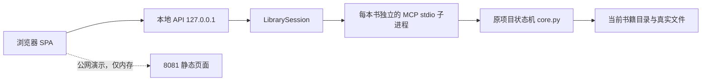

# `codex/local-mcp-library-plan`：Codex 协作分支交接手册

> 这是 `realwindjpn/novel-agent-workflow` 上的协作分支交接文档。它不是合作仓库 `main` 的说明，也不要求把本分支合并进 `main`。

如果你是刚接手这个分支的 Codex，先记住一件事：这里保留了原项目“文件优先、状态机驱动”的小说工作流核心，同时增加了一套只在本机运行的网页创作工作台。后续改动应当围绕这两个事实展开，而不是把网页当成另一个独立产品。

## 先确认你在哪条分支

合作仓库只允许更新这一条分支：

```text
codex/local-mcp-library-plan
```

不要向合作仓库的 `main` 推送、合并、变基或强推。推荐的接手方式：

```powershell
git fetch partner --prune
git switch -c codex/local-mcp-library-plan --track partner/codex/local-mcp-library-plan
```

如果本地已经有同名分支，先确认它跟踪的是正确远端：

```powershell
git branch -vv
git status --short --branch
```

完成后只推送回合作分支：

```powershell
git push partner HEAD:codex/local-mcp-library-plan
```

## 这个项目原本解决什么

原项目不是“自动写小说”的模型壳，而是一套小说项目的状态机。

一本书的创意、提纲、章节、评审和发布都写入真实文件；CLI 与 MCP 只是操作这些文件和状态的入口。核心规则包括：大纲没有锁定不能签发章节，章节没有签发不能录入草稿，评审不完整不能发布，改稿后受影响评审会回到待评审。

主要角色是：

- `controller`：推进阶段、记录状态、阻止假完成；
- `author`：提交候选稿；
- `editor` 与 `reader`：独立评审；
- `military_consultant` 与 `science_consultant`：领域评审或明确跳过。

原项目的 Python 核心在：

```text
src/novel_workflow/core.py
```

不要绕过它直接伪造 `workflow.json`、章节状态或发布凭证。状态校验、评审证据、角色独立性和修复后的重置逻辑都在这里。

## 当前分支新增了什么

这个分支把原有流程做成可在 Windows 本机日常使用的创作工作台。



分支中的主要扩展：

- `web/`：零构建浏览器工作台；包含引导流水线、终端、文件查看器、自由创作、浮动聊天和书库界面。
- `scripts/launch_web.py`：本地启动器；同时启动可写本地端与静态演示端，可选 Cloudflare Quick Tunnel。
- `scripts/local_mcp_bridge.py`：书库会话和 MCP stdio 客户端；每次只让一本文书处于活动状态。
- `src/novel_workflow/library.py`：书库目录、章节工作目录、回收区与路径安全的纯逻辑。
- `scripts/creative_store.py`：自由创作会话、证据账本、方案与备份的本地存储。

## 启动：先用本地可写端

在仓库根目录运行：

```powershell
.\一键启动.cmd
```

默认页面：

| 地址 | 用途 | 是否写入本机书库 |
| --- | --- | --- |
| `http://localhost:8080` | 本地 MCP 工作台 | 是 |
| `http://localhost:8081` | 静态演示 / 浏览器内存模式 | 否 |
| Cloudflare 临时 URL | 指向 8081 的演示链接 | 否 |

若 8080 已被占用，不要结束不明进程；直接换端口：

```powershell
.\一键启动.cmd --port 9090 --public-port 9091
```

只做本机测试、不需要隧道：

```powershell
.\一键启动.cmd --no-tunnel
```

启动器会优先使用 `.venv\Scripts\python.exe`。需要 Python 3.11+；只有启用临时公网演示时才需要 `cloudflared` 在 `PATH` 中。

关闭启动器窗口或按 `Ctrl+C` 会停止 HTTP 服务、活动 MCP 子进程与隧道。不要通过进程名批量结束 `python.exe`、`ngrok.exe` 或 `cloudflared.exe`；这台机器可能同时运行其他项目。

## 正确理解本地书库

默认书库是：

```text
<仓库根目录>/book
```

也可以启动时指定：

```powershell
.\一键启动.cmd --library-root D:\MyBooks
```

在网页中选择书库后，再新建或选择一本书，最后点“继续创作”。只有选中的活动书会启动 MCP 子进程。每本书是一个立即子目录，至少包含自己的 `workflow.json`。

书库不能接受路径穿越、符号链接逃逸或 Windows 目录联接逃逸。不要为了“方便”放宽这些校验；它们是本地网页可安全访问磁盘的前提。

## 章节：如何查看与推进

项目层面的章节账本位于 `workflow.json.chapters`，但每一章的单独状态文件仍是事实来源。系统会将账本与磁盘上的章节状态合并，因此可恢复意外中断后的进度。

章节素材目录使用稳定命名：

```text
chapters/第001章_YYYYMMDD/
```

常用命令：

```powershell
novel-workflow chapters <书籍目录> --human
novel-workflow status <书籍目录> --chapter 1 --human
```

网页右侧“文件”抽屉显示当前活动书的真实目录树，可查看 `workflow.json`、章节草稿、评审与发布凭证。它不是专门的小说阅读器：目前没有“上一章 / 下一章”式章节阅读视图；需要阅读正文时直接打开对应草稿或章节文件。

网页左侧的 22 步“连续运行”会按顺序运行尚未完成的引导步骤。它是演示/验证工具，不是后台定时任务，也不是无人值守写作系统；对真实书籍执行前应清楚它会改变当前活动书的状态。

## 自由创作与正式流程的关系

自由创作模式用于先聊人物、氛围、冲突和方向，不会因为一句自然语言输入就直接篡改正式工作流。

- 第一轮自然语言回复在主工作区显示；
- 连续第二轮自然对话会迁移到可拖动、缩放、最小化的浮动窗口；
- 已知命令与无效的 `novel-workflow` 命令仍留在终端；
- 对话证据、收敛状态和方案按书籍保存，也支持 ZIP 备份；
- 方案必须完整且未过期，先在浮动窗口确认，再在主工作台执行，才会进入正式流程。

自由创作页中的“流水线”和“文件”是抽屉。文件抽屉自身标题栏有“收起”按钮；不要删除这条入口，否则打开后顶部开关会被右侧抽屉遮住。

## 回收区不是永久删除

选中书籍后可“移入回收区”。实际行为是将书目录移动到：

```text
<书库>/.trash/<时间戳>__<原目录名>/
```

并写入 `.trash-info.json`。恢复时不会覆盖同名目录，冲突会使用 `（恢复1）`、`（恢复2）` 后缀。网页没有永久删除接口；真正清理只能由用户在本机文件系统中删除回收目录。

回收活动书前，桥接层会先关闭该书 MCP 子进程。不能把活动书目录直接用其他脚本移动、重命名或删除。

## MCP 与本地 API：不要破坏的边界

MCP 服务实现位于：

```text
src/novel_workflow/mcp_server.py
```

本地网页只通过启动器提供的私有 API 访问它。启动器对本地 API 使用随机令牌、严格的同源检查和 MCP 方法白名单；公网静态端不注册 `/api/local/*`，请求必须是 `404`。

改动时必须保留这些事实：

- 只有本地端可以写书库；
- 公网端与临时隧道只演示页面，不拿到本地令牌或书库路径；
- `LibrarySession` 的活动书切换必须串行化；
- MCP 子进程关闭时要关闭其标准输入输出管道，避免资源警告；
- 所有书库、回收区和文件树路径都必须留在选定根目录内。

## 先读哪里，再改哪里

| 目标 | 优先阅读 |
| --- | --- |
| 状态机与章节门禁 | `src/novel_workflow/core.py` |
| CLI 命令定义 | `src/novel_workflow/cli.py` |
| MCP 工具与 JSON-RPC 路由 | `src/novel_workflow/mcp_server.py`、`docs/MCP.md` |
| 本地书库、活动书与回收区 | `scripts/local_mcp_bridge.py`、`src/novel_workflow/library.py` |
| 双端口启动、令牌、API 隔离 | `scripts/launch_web.py` |
| 网页交互 | `web/index.html`、`web/app.js`、`web/local.js`、`web/creative-chat.js`、`web/floating-chat.js` |
| 文件浏览 | `web/explorer.js` |
| 回归测试 | `tests/`、`tests/js/` |

`web/sources.js` 是由 `src/novel_workflow/` 生成的浏览器快照。修改 Python 核心后，要检查 `scripts/gen_web_sources.py` 的生成契约；不要手工把逻辑改一半到 `web/sources.js`，一半留在 `src/`。

## 验证顺序

文档改动至少运行：

```powershell
git diff --check
```

涉及 Python 或本地 API 时，使用仓库 Python，并确保能导入 `src`：

```powershell
$env:PYTHONPATH = "$PWD\src"
.\.venv\Scripts\python.exe -m unittest discover -s tests
.\.venv\Scripts\python.exe scripts\release_check.py
```

涉及网页交互时，再运行 JavaScript 测试：

```powershell
node --test tests/js/*.mjs
```

Windows 真机验收入口是：

```powershell
$env:PYTHONPATH = "$PWD\src"
.\.venv\Scripts\python.exe _local_acceptance.py
```

它会验证本地端令牌、公开端 `404`、书籍创建、同名处理和干净关闭。任何验收都应使用临时书库；不要移动或修改真实 `book/` 下的用户作品。

## 已实现与未实现

已实现：状态机、CLI、stdio MCP、本地网页工作台、书库、章节账本、文件树、自由创作、浮动聊天、ZIP 备份、回收区、双端口隔离与 Windows 启动器。

未实现：番茄小说、起点、晋江等平台的投稿 API；账号、Cookie 或凭据管理；模拟浏览器登录/上传；定时发布队列；把本地 `release` 自动发到任何外部平台。

这里的 `release` 只代表本地工作流通过全部门禁，并写入 `releases/chapter-N.json` 凭证。不要把它描述成或改造成隐式的外部平台投稿。

## 提交前最后检查

```powershell
git diff --check
git status --short --branch
git log --oneline -8
```

确认当前分支不是合作仓库 `main` 后，再执行：

```powershell
git push partner HEAD:codex/local-mcp-library-plan
```

这份分支的目标是让本地创作工作台保持可用、可验证、可恢复；任何新功能都应先证明它不会绕过原项目状态机，也不会穿透本地/公网边界。
