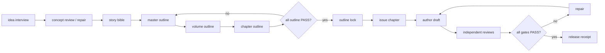

# Novel Agent Workflow

[中文](docs/README.zh-CN.md) · [Beginner Guide](docs/BEGINNER_GUIDE.md)

[](https://github.com/realwindjpn/novel-agent-workflow/actions/workflows/ci.yml)
[](LICENSE)
[](pyproject.toml)
[](pyproject.toml)
[](pyproject.toml)

A file-first, tool-neutral, gate-driven workflow for taking a fiction idea from first spark to reviewed outline and chapter issue.

This project does **not** promise one-click novels. It provides contracts, role separation, review evidence, recovery state, and release gates for humans, local tools, or AI agents.

## Core product

Beginner path:



A chapter cannot be issued until every outline level is `PASS` and the outline is locked.

## Six roles

| Role | Responsibility | Evidence contract |
|---|---|---|
| `controller` | Routes stages, records state, verifies evidence, blocks false completion. | State files, event trail, release receipt. |
| `author` | Writes a candidate draft from the chapter contract and Author Role OS prewrite card. | Draft artifact plus prewrite checksum. |
| `editor` | Independent craft review: structure, pacing, prose, DEAI, audience respect. | `editor:<id>` review with cited evidence. |
| `reader` | Independent real reading-experience review: clarity, immersion, fatigue, over-explanation. | `reader:<id>` review with cited experience. |
| `military_consultant` | Reviews tactics, force, conflict, command, logistics when applicable. | `military:<id>` PASS/FAIL or SKIP_WITH_REASON. |
| `science_consultant` | Reviews physical, biological, technical, and world-rule plausibility when applicable. | `science:<id>` PASS/FAIL or SKIP_WITH_REASON. |

Editor and reader identities must differ from the author, and the reader identity must differ from the editor. Military and science consultants may return `SKIP_WITH_REASON` when no applicable content exists, but they may not be absent.

## Chapter gates

Required chapter gates are:

- `author`: candidate draft exists and has an Author Role OS prewrite card.
- `editor`: DEAI and audience-respect evidence is present and PASS.
- `reader`: real reading-experience evidence is present and PASS.
- `military`: PASS, FAIL, or SKIP_WITH_REASON with written reason.
- `science`: PASS, FAIL, or SKIP_WITH_REASON with written reason.

When a repair changes a draft, affected gates reset to `PENDING`; stale release receipts are removed and the affected gates must be reviewed again.

## Human-friendly terminal output (opt-in)

Every command emits machine-readable JSON by default so scripts, tests, and the optional model-routing HUD keep working. For interactive use, append `--human` to inspection commands to get a colored, scannable summary. Color is auto-disabled when stdout is piped, when `NO_COLOR` is set, or when `TERM=dumb`, so CI logs and pipe-friendly automation stay clean.

```text
$ novel-workflow status demo --chapter 1 --human
── project · The Silent Relay ──────────────────────────────────────────────

  stage:        OUTLINE_LOCKED
  errors:       none

── chapter · #1 ──────────────────────────────────────────────────────────

  chapter:      #1 — First Signal
  status:       ● READY
  author:       author:noa
  editor:       ✓ PASS  editor:mal
  reader:       ✓ PASS  reader:jun
  military:     – SKIP  military:bea  — No applicable content this chapter.
  science:      – SKIP  science:kim  — No applicable content this chapter.
  errors:       none
  next:         novel-workflow release <project> 1
```

`--human` is opt-in on `status`, `check`, `chapters`, `roles`, and `intake-check`. The renderer lives in `src/novel_workflow/_visual.py`: pure stdlib, `NO_COLOR`-aware, and never embeds provider or model names in style codes. See `tests/test_visual.py` for the no-TTY and `NO_COLOR` guarantees.

## Quick start

```bash
python -m venv .venv
. .venv/bin/activate
pip install -e .

novel-workflow init demo --title "The Silent Relay"
# Fill all 15 structured fields in templates/idea_interview.md first.
novel-workflow intake-check demo --interview '{"audience":"...","genre":"...","target_words":{"target":90000},"premise":"...","world":"...","protagonist":"...","supporting_cast":"...","central_conflict":"...","stakes":"...","character_arc":"...","style":"...","structure":"...","ending":"...","boundaries":"...","craft_patterns":["..."]}'
novel-workflow idea demo --summary "A relay crew hears an impossible signal." --interview '{complete structured intake JSON}'

printf '# Concept Review
PASS
' > demo/concept-review.md
novel-workflow concept-review demo PASS --artifact concept-review.md --reviewer controller:concept-a

printf '# Story Bible
A repair crew maintains an old relay above a moon.
' > demo/bible.md
novel-workflow bible demo --artifact bible.md

printf '# Master Outline
Story spine.
' > demo/master.md
printf '# Master Review
PASS
' > demo/master-review.md
novel-workflow outline-write demo master --artifact master.md
novel-workflow outline-review demo master PASS --artifact master-review.md --reviewer controller:master-a

printf '# Volume Outline
Volume function.
' > demo/volume.md
printf '# Volume Review
PASS
' > demo/volume-review.md
novel-workflow outline-write demo volume --artifact volume.md
novel-workflow outline-review demo volume PASS --artifact volume-review.md --reviewer controller:volume-a

printf '# Chapter Outline
Chapter function.
' > demo/chapter-outline.md
printf '# Chapter Outline Review
PASS
' > demo/chapter-outline-review.md
novel-workflow outline-write demo chapter --artifact chapter-outline.md
novel-workflow outline-review demo chapter PASS --artifact chapter-outline-review.md --reviewer controller:chapter-a

novel-workflow outline-lock demo
novel-workflow issue demo 1 --title "First Signal" --goal "Introduce the disputed signal"
```

See `docs/BEGINNER_GUIDE.md` for a full draft/review/release walkthrough.

## MCP server (Model Context Protocol)

An embedded, zero-dependency stdio MCP server ships in the same package. The
core workflow stays file-first and tool-neutral; the MCP surface is a thin
adapter that hands the state machine to any MCP-aware agent.

```bash
# Talk to the server over stdin/stdout (newline-delimited JSON-RPC 2.0).
echo '{"jsonrpc":"2.0","id":1,"method":"initialize","params":{"protocolVersion":"2024-11-05","capabilities":{},"clientInfo":{"name":"demo"}}}' \
  | novel-workflow mcp
```

The server exposes:

- **21 state-machine tools** — one per public CLI command (`init`, `idea`,
  `concept-review`, `bible`, `outline-write`, `outline-review`, `outline-repair`,
  `outline-lock`, `issue`, `draft`, `review`, `repair`, `release`, `status`,
  `intake-check`, `prewrite`, `lock-check`, `read-artifact`, `write-artifact`,
  `read-chapter`, `events`), each with a full JSON Schema and the same
  evidence contract the CLI enforces.
- **3 resources** — `novel://state` (live `workflow.json`), `novel://events`
  (append-only JSONL tail), `novel://chapter/{n}` (per-chapter gate status).
- **6 prompts** — one per role (`controller`, `author`, `editor`, `reader`,
  `military_consultant`, `science_consultant`) with the role's evidence
  contract embedded in the prompt text so the agent cannot accidentally
  skip the contract.
- **Dual-channel errors** — protocol errors (parse / unknown method / missing
  params) come back as JSON-RPC errors with standard codes `-32700 / -32601 /
  -32602 / -32603`; business errors (gate not met, role:identifier
  collision, illegal transition) come back as a normal response with
  `isError: true` and a redacted message. Agents can branch on the channel.
- **Project jail** — `write-artifact` and `read-artifact` cannot touch
  `workflow.json` or `.novel-workflow/**`. Those files are only reachable
  through the state-machine tools, so the agent cannot bypass the state
  machine by writing state files directly.
- **Single-source limits** — `workflow.json["limits"]` (with defaults in
  `core.DEFAULT_LIMITS` and the unique read entry `core.load_limits()`) is
  shared by CLI, MCP, and the web runner. There is no second copy.
- **`initialize.instructions` injection** — the server returns a six-role
  philosophy text on initialize so the agent inherits the same discipline
  the CLI would have applied.

Full design, wire protocol, tool/resource/prompt catalogs, and a CLI
transcript live in [`docs/MCP.md`](docs/MCP.md). Tests are in
`tests/test_mcp_server.py` (31 cases covering protocol negotiation, the
dual-channel error model, the project jail, the full state-machine path
from idea to release, and `max_chapters` enforcement).

## Web live runner (browser SPA)

A zero-build, zero-backend browser UI ships under [`web/`](web/). It runs
the same Python package in the browser through Pyodide, so the 22-step
state machine, the gates, the `workflow.json` / `events.jsonl` file
format, and the `core.load_limits()` single-source limits are the same
on every surface. The web runner is a **third entry point** into the
same contract, not a fork.

The three entry points are independent code paths: the CLI
(`novel-workflow ...`), the MCP server (`novel-workflow mcp`), and this
web SPA. They share no runtime code — the web side does not import from
the CLI, the CLI does not import from the web. What they share is
**one core source contract**: `web/sources.js` is a verbatim snapshot of
`src/novel_workflow/*.py`, regenerated by a single script:

```bash
python scripts/gen_web_sources.py
```

Change a Python file, regenerate, and the browser catches up. The list
of mounted files at the top of `scripts/gen_web_sources.py` is the
canonical reference for what the SPA actually loads; hand-edits to
`web/sources.js` are silently overwritten. There is no second copy of
any package code, no second copy of any limit value, and no second
deny-list. The scanner, the state machine, and the limits block live
in one place each.

Two modes share the same engine and project state: **Code** (the
original 22-step walkthrough, terminal, file tree) and **Plain Chinese
(白话)** (natural-language intent layer with confirm-before-execute
cards). An optional LLM BYOK layer is opt-in: when no key is set, or
the chosen endpoint is unreachable, the runner falls back silently to
the rule-based intent engine — no degraded state, no half-promises.

### Windows one-click start (local + temporary public URL)

With Python 3.11+ and
[`cloudflared`](https://developers.cloudflare.com/cloudflare-one/connections/connect-networks/downloads/)
installed, double-click:

```text
一键启动.cmd
```

The launcher starts the SPA on `http://localhost:8080`, creates a random
`https://….trycloudflare.com` Quick Tunnel, waits for both endpoints, and then
opens the local page automatically. The public URL is temporary and has no
login protection: anyone with the link can access the page while the launcher
is running. Press Ctrl+C or close the launcher window to stop both services.

Optional command-line use:

```powershell
.\一键启动.cmd --port 9090
.\一键启动.cmd --no-browser
```

Manual local-only fallback (any static server works):

```bash
cd web
python3 -m http.server 8080
# open http://localhost:8080
```

Pyodide fetches its own interpreter and packages from a public CDN on
first load (~10s); subsequent loads are cached. If the WASM engine
takes too long to respond, the page falls back to a recorded Replay
mode so the flow is still explorable. See [`web/README.md`](web/README.md)
for the file layout, the snapshot refresh contract, and the mode-by-mode
behavior.

## Optional model routing

The core workflow remains offline and model-free. If you want external model
assistance, initialize a separate provider-neutral configuration:

```bash
novel-workflow model init-config model_routing.toml
novel-workflow model smoke --config model_routing.toml
novel-workflow model route-plan --config model_routing.toml \
  --genre sci-fi --risk physics --risk combat
novel-workflow model model-ledger --config model_routing.toml \
  --genre sci-fi -o model-ledger.jsonl
```

The configuration stores environment-variable names only. Every run performs
a fresh semantic-response smoke before allocating roles; old ledger results
cannot authorize a new run. Candidates may use an OpenAI-compatible HTTP
endpoint or a custom command adapter. `author`, `editor`, and `reader` are
always considered; consultant roles are selected from genre and outline-risk
signals, so military and science are not global defaults. See
`templates/model_routing.example.toml` and `templates/env.example`.

The repository does not ship or recommend a production model roster. Users
configure their own providers and models. One model may serve multiple roles,
or different models may serve different roles. Independence means separate
role executions and distinct provenance identifiers for author/editor/reader
evidence; it does not require different underlying model names.

Before an expensive run, use `model budget` to estimate selected-role calls,
input/output tokens, and (only when you supply pricing) a cost range. Revision
rounds multiply usage: five active model roles over three full passes means 15
role calls. Use `model route-plan` to inspect `continuity`: one current-PASS
candidate is `READY_SINGLE_ROUTE` and therefore at risk; two or more are
`READY_WITH_FALLBACK`. Runtime integrations should persist each completed role
before starting the next and use `execute_with_fallback` to move to the next
current-PASS candidate after a route failure. Exhausted chains must become an
explicit blocked state, never a silent hang or false completion.

For a no-network routing decision/HUD, use `model route-task`. It supports
C0-C3 tiers, capability hard filters (`text`, `vision`, `code`, `tools`,
`long_context`, etc.), exact `--provider/--model` locks, health states
`unavailable | quota_exhausted | rate_limited | healthy`, cost/quota/confidence
sorting, and `repair` status when repeated failures are supplied:

```bash
novel-workflow model route-task --config model_routing.toml \
  --task "review a long technical chapter" --role editor --tier C3 \
  --capability long_context --capability tools
```

```bash
novel-workflow model budget --config model_routing.toml \
  --genre sci-fi --risk physics --risk combat \
  --revision-rounds 3 --input-tokens-per-call 12000 \
  --output-tokens-per-call 2500
```

the CLI would have applied.

Full design, wire protocol, tool/resource/prompt catalogs, and a CLI
transcript live in [`docs/MCP.md`](docs/MCP.md). Tests are in
`tests/test_mcp_server.py` (31 cases covering protocol negotiation, the
dual-channel error model, the project jail, the full state-machine path
from idea to release, and `max_chapters` enforcement).

the CLI would have applied.

the CLI would have applied.

Full design, wire protocol, tool/resource/prompt catalogs, and a CLI
transcript live in [`docs/MCP.md`](docs/MCP.md). Tests are in
`tests/test_mcp_server.py` (31 cases covering protocol negotiation, the
dual-channel error model, the project jail, the full state-machine path
from idea to release, and `max_chapters` enforcement).

## Included

- zero-runtime-dependency Python CLI
- file-first state machine
- append-only JSONL event trail
- six-role public skills and templates
- fictional demo project
- release scanner for secrets, absolute home paths, forbidden tracked working files, tests, and CLI smoke
- browser live runner under web/ (zero-build SPA; same core source contract as CLI and MCP)

## Not included

- manuscripts or private story bibles
- account state, cookies, browser profiles, credentials, or route files
- publishing automation
- model calls or hosted service integrations
- proprietary prompts or copied third-party repository code

## Verify

```bash
python -m unittest discover -s tests -v
python scripts/release_check.py
```

## License

Apache License 2.0. See [LICENSE](LICENSE), [NOTICE](NOTICE), and [THIRD_PARTY_NOTICES.md](THIRD_PARTY_NOTICES.md).
